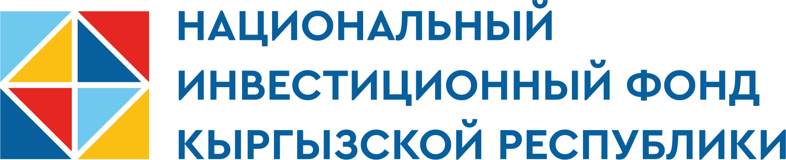

# National Investment Fund of the Kyrgyz Republic / Национальный инвестиционный фонд Кыргызской Республики

<p align="center">
  
</p>

<p align="center">
  <strong>NIF KR · НИФ КР</strong><br />
  Official website of the National Investment Fund of the Kyrgyz Republic<br />
  Официальный сайт Национального инвестиционного фонда Кыргызской Республики
</p>

<p align="center">
  <a href="https://nif.kg">nif.kg</a> ·
  <a href="#english">English</a> ·
  <a href="#русский">Русский</a>
</p>

---

## English

### About the project

This repository contains the official web presence of the **National Investment Fund of the Kyrgyz Republic (NIF KR)** — an open joint-stock company that connects the state, business, and investors. The Fund channels long-term capital into projects that create real economic impact and accelerate Kyrgyzstan’s development.

The Fund was established by Resolution of the Cabinet of Ministers of the Kyrgyz Republic No. 666 dated 5 November 2024, pursuant to the Law “On the National Investment Fund of the Kyrgyz Republic” and Presidential Decree No. 155 of 14 June 2024.

### What the site includes

| Section | Description |
| --- | --- |
| **Home** | Immersive scrollytelling hero with brand, decree story, and key counters |
| **About** | Mission, objectives, legal status, leadership, and documents |
| **Project financing** | Investment instruments and application form |
| **Priority directions** | Industry, logistics, energy, tourism, education, healthcare |
| **SME projects** | Interactive map of small and medium business projects across Kyrgyzstan |
| **Partners** | Registry, cooperation, and accreditation |
| **News** | Fund news and announcements |
| **Contacts** | Address, phones, hotline, Instagram & WhatsApp |

### Languages

The interface is available in four languages:

- **RU** — Russian  
- **KG** — Kyrgyz  
- **EN** — English  
- **ZH** — Chinese (shown as CN in the UI)

### Tech stack

| Layer | Tools |
| --- | --- |
| Framework | [TanStack Start](https://tanstack.com/start) · React 19 · Vite 8 |
| Styling | Tailwind CSS 4 · Radix UI |
| Motion | GSAP · Framer Motion · Lenis |
| Maps | Leaflet · React Leaflet |
| Forms | React Hook Form · Zod |
| Language | TypeScript |

### Getting started

**Requirements:** Node.js 20+ (or [Bun](https://bun.sh))

```bash
# Install dependencies
npm install

# Start the development server
npm run dev

# Production build
npm run build

# Preview the production build
npm run preview
```

Useful scripts:

```bash
npm run lint      # ESLint
npm run format    # Prettier
```

### Project structure

```
src/
├── components/     # UI, sections, scrollytelling, maps
├── data/           # News, partners, SME projects
├── hooks/          # Shared React hooks
├── lib/            # Brand, i18n, navigation, utilities
└── routes/         # File-based routes (TanStack Router)
public/             # Static assets (images, icons, docs, geo)
```

### Contacts

| | |
| --- | --- |
| **Website** | [nif.kg](https://nif.kg) |
| **Phone** | +996 312 88 66 68 · +996 880 00 04 30 |
| **Hotline** | +996 990 00 30 55 |
| **Instagram** | [@nif.kg.official](https://www.instagram.com/nif.kg.official) |
| **WhatsApp** | [+996 880 00 04 30](https://wa.me/996880000430) |

---

## Русский

### О проекте

В этом репозитории — официальный сайт **Национального инвестиционного фонда Кыргызской Республики (НИФ КР)** — открытого акционерного общества, которое связывает государство, бизнес и инвесторов. Фонд направляет долгосрочный капитал в проекты, создающие реальный экономический эффект и ускоряющие развитие Кыргызстана.

Фонд учреждён постановлением Кабинета Министров КР от 5 ноября 2024 года № 666 во исполнение Закона «О Национальном инвестиционном фонде Кыргызской Республики» и Указа Президента КР № 155 от 14 июня 2024 года.

### Что есть на сайте

| Раздел | Описание |
| --- | --- |
| **Главная** | Иммерсивный scrollytelling-герой с брендом, историей учреждения и ключевыми счётчиками |
| **О фонде** | Миссия, задачи, правовой статус, руководство и документы |
| **Финансирование проектов** | Инвестиционные инструменты и форма заявки |
| **Перспективные направления** | Промышленность, логистика, энергетика, туризм, образование, здравоохранение |
| **Проекты МСБ** | Интерактивная карта проектов малого и среднего бизнеса по Кыргызстану |
| **Партнёры** | Реестр, сотрудничество и аккредитация |
| **Новости** | Новости и анонсы Фонда |
| **Контакты** | Адрес, телефоны, горячая линия, Instagram и WhatsApp |

### Языки

Интерфейс доступен на четырёх языках:

- **RU** — русский  
- **KG** — кыргызский  
- **EN** — английский  
- **ZH** — китайский (в UI отображается как CN)

### Технологии

| Слой | Инструменты |
| --- | --- |
| Фреймворк | [TanStack Start](https://tanstack.com/start) · React 19 · Vite 8 |
| Стили | Tailwind CSS 4 · Radix UI |
| Анимация | GSAP · Framer Motion · Lenis |
| Карты | Leaflet · React Leaflet |
| Формы | React Hook Form · Zod |
| Язык | TypeScript |

### Запуск

**Требования:** Node.js 20+ (или [Bun](https://bun.sh))

```bash
# Установка зависимостей
npm install

# Режим разработки
npm run dev

# Сборка для продакшена
npm run build

# Предпросмотр продакшен-сборки
npm run preview
```

Полезные скрипты:

```bash
npm run lint      # ESLint
npm run format    # Prettier
```

### Структура проекта

```
src/
├── components/     # UI, секции, scrollytelling, карты
├── data/           # Новости, партнёры, проекты МСБ
├── hooks/          # Общие React-хуки
├── lib/            # Бренд, i18n, навигация, утилиты
└── routes/         # Файловые маршруты (TanStack Router)
public/             # Статика (изображения, иконки, документы, geo)
```

### Контакты

| | |
| --- | --- |
| **Сайт** | [nif.kg](https://nif.kg) |
| **Телефон** | +996 312 88 66 68 · +996 880 00 04 30 |
| **Горячая линия** | +996 990 00 30 55 |
| **Instagram** | [@nif.kg.official](https://www.instagram.com/nif.kg.official) |
| **WhatsApp** | [+996 880 00 04 30](https://wa.me/996880000430) |

---

<p align="center">
  © 2026 National Investment Fund of the Kyrgyz Republic · НИФ КР<br />
  Developer / Разработчик: Gaipov Bakyt
</p>
